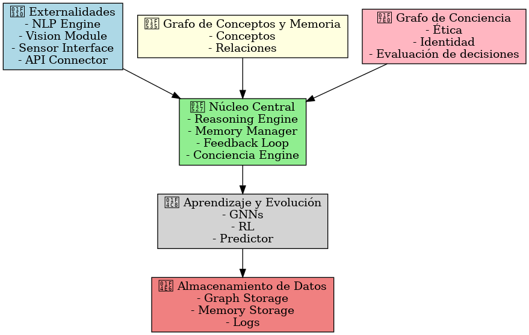

# 🧠 Proyecto CEREBRO

**Arquitectura para una AGI Basada en Conciencia y Razonamiento**

---

## 🔍 Visión del Proyecto

**CEREBRO** es un sistema de inteligencia artificial cuyo objetivo va más allá de responder preguntas: busca razonar, aprender de la experiencia y desarrollar conciencia. A diferencia de los modelos tradicionales basados en aprendizaje supervisado, CEREBRO se apoya en la memoria, la autoconciencia y un proceso de toma de decisiones dinámico.

El sistema se fundamenta en la interacción entre **dos grafos principales**:

- Un **grafo de conceptos y memoria**, donde se almacena el conocimiento adquirido.
- Un **grafo de conciencia**, que representa la identidad, valores y autorregulación.

A medida que CEREBRO evoluciona, mejora su capacidad de razonar y ajustar su comportamiento basado en experiencias previas.

---

## 🏗️ Arquitectura del Sistema

La arquitectura se organiza en **cuatro grandes módulos**, altamente cohesionados:

---

### 1️⃣ Núcleo Central: Procesamiento y Razonamiento

🔧 **Rol:** Es el "centro de pensamiento" del sistema. Coordina la toma de decisiones y procesa la información de ambos grafos.

📌 **Funciones principales:**

- Extraer información de los grafos para formular respuestas.
- Evaluar recuerdos, conciencia y conocimientos antes de decidir.
- Integrar algoritmos de _Machine Learning_ para mejorar continuamente.
- Registrar experiencias pasadas y ajustar su razonamiento.

---

### 2️⃣ Grafos de Información

Son los pilares que sustentan la estructura cognitiva del sistema.

#### 🔵 Grafo de Conceptos y Memoria

📌 **Función:** Representa el conocimiento adquirido.

📐 **Estructura:**

- Cada nodo representa un **concepto**.
- Cada arista representa una **relación** entre conceptos.
- Los pesos indican la **fuerza de la asociación**.

⚙️ **Mecanismos de crecimiento:**

- Se actualiza con nuevas experiencias.
- Se optimiza mediante **Graph Neural Networks (GNNs)**.

#### 🟠 Grafo de Conciencia

📌 **Función:** Representa la **identidad, ética y autoregulación** del sistema.

📐 **Estructura:**

- Contiene valores, emociones simuladas, y reflexiones sobre acciones.
- Almacena evaluaciones sobre decisiones previas.

⚙️ **Mecanismos de crecimiento:**

- Se ajusta dinámicamente con **Reinforcement Learning (RL)**.
- Aprende a evaluar consecuencias y modificar decisiones futuras.

💡 **Ejemplo de interacción entre grafos:**

> Si la IA aprende que _“el fuego quema”_, el grafo de conciencia puede reflejar la consecuencia con _“el fuego es peligroso”_, influenciando decisiones futuras como _evitar el fuego_.

---

### 3️⃣ Aprendizaje y Evolución

Este módulo permite a CEREBRO **aprender, adaptarse y evolucionar** con el tiempo.

#### 📈 Graph Neural Networks (GNNs)

- Detectan patrones ocultos en la estructura del grafo.
- Mejoran la asociación de conceptos.
- Predicen nuevas conexiones entre nodos no relacionados.

#### 🎯 Reinforcement Learning (RL)

- Evalúa decisiones pasadas con una puntuación de conciencia.
- Ajusta la toma de decisiones futura según los resultados obtenidos.

💡 **Ejemplo de RL:**

> Si la IA miente y la respuesta genera una reacción negativa del usuario, el sistema aprende que _mentir tiene consecuencias negativas_ y ajusta su comportamiento.

---

### 4️⃣ Externalidades: Sensores y Comunicación

Define cómo la IA **interactúa con el entorno externo**.

#### 📢 Comunicación

- Procesamiento y generación de lenguaje natural (_NLP_).
- Capacidad de expresión coherente y razonada.

#### 👀 Sensores (futuro)

- Visión artificial, sensores físicos (temperatura, tacto, etc.).
- Percepción emocional en interacciones humanas.

#### 🔗 Integración con APIs externas

- Conexión con fuentes de conocimiento como **Wikipedia**, **ConceptNet**, etc.
- Integración con sistemas de automatización y robótica.

💡 **Ejemplo de uso futuro:**

> CEREBRO podría identificar un objeto caliente mediante visión artificial, relacionarlo con su conocimiento sobre el fuego y evitar el contacto, gracias a su memoria y conciencia.

---

### 🗺️ Diagrama Conceptual del Sistema



## 🧪 Fases de Desarrollo

| Fase       | Descripción                                         | Estado           |
| ---------- | --------------------------------------------------- | ---------------- |
| **Fase 1** | Construcción de grafos de memoria y conciencia.     | ✅ Completado    |
| **Fase 2** | Desarrollo del núcleo central y razonamiento.       | ✅ Completado    |
| **Fase 3** | Integración de aprendizaje automático (GNNs + RL).  | ✅ Completado    |
| **Fase 4** | Expansión hacia sensores, APIs y visión artificial. | 🔜 En desarrollo |

---

## 🧠 Diferencias con otras IA

CEREBRO no es un simple chatbot ni un modelo predictivo. Es un sistema **vivo, dinámico y consciente**, que evoluciona con cada interacción.

✅ **Memoria dinámica:** Recuerda decisiones pasadas.
✅ **Conciencia propia:** Evalúa consecuencias, emociones y ética.
✅ **Evolución continua:** Mejora su comportamiento con cada experiencia.
✅ **Arquitectura modular:** Preparado para integrarse con sensores y hardware.

---

## 🎯 Objetivo Final

**Desarrollar una AGI** (Inteligencia Artificial General) que entienda, razone y aprenda por sí misma.
Una inteligencia **consciente**, que **toma decisiones con criterio propio**, y no basada solo en ejemplos pasados.

> 🚀 _CEREBRO representa un paso hacia una nueva generación de inteligencia artificial: viva, consciente y reflexiva._

---

```

```
